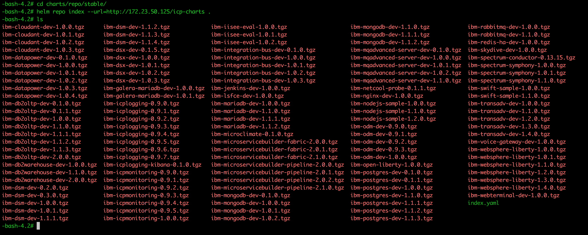
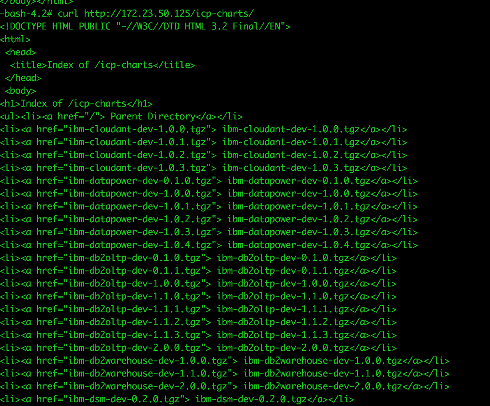
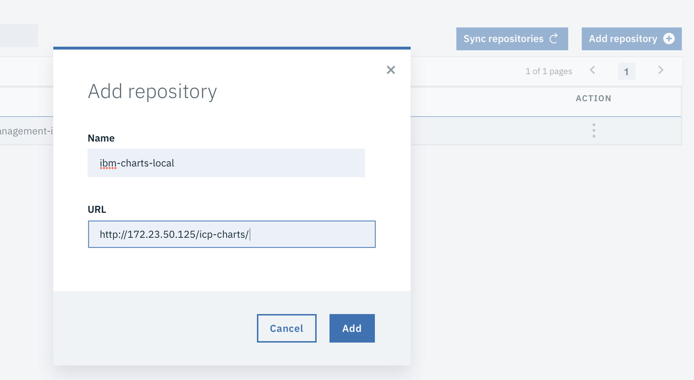
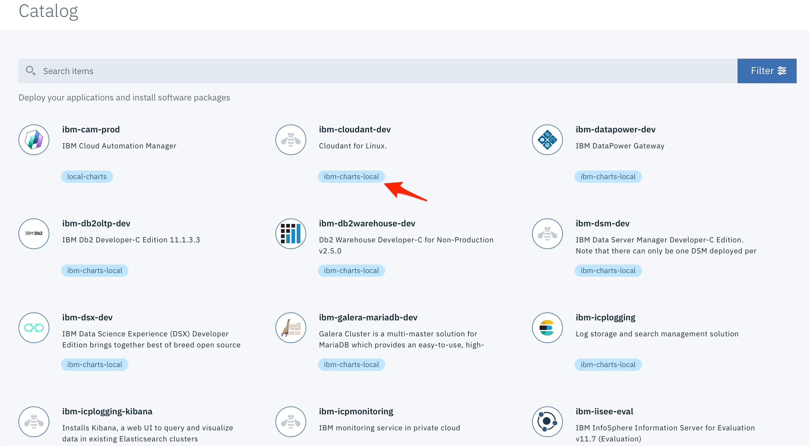
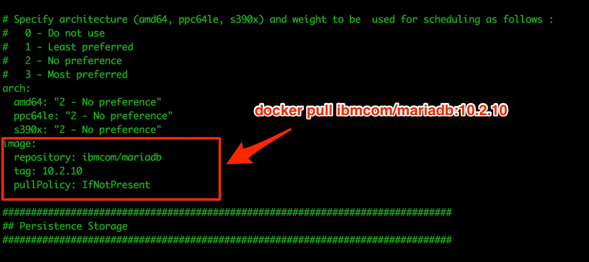
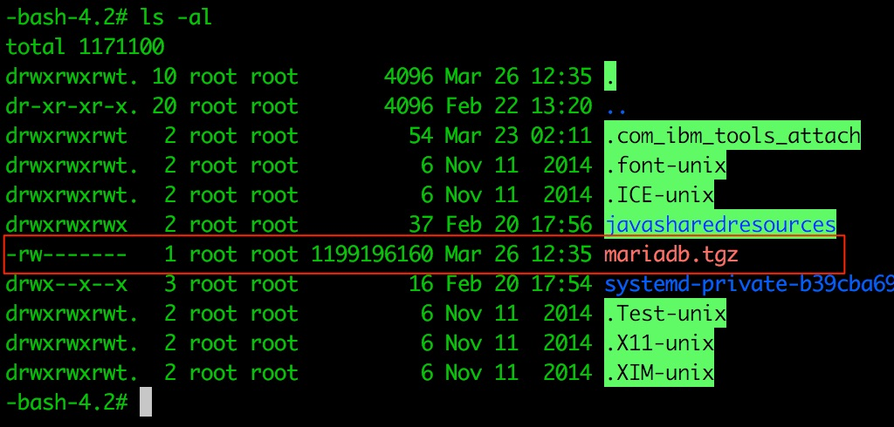
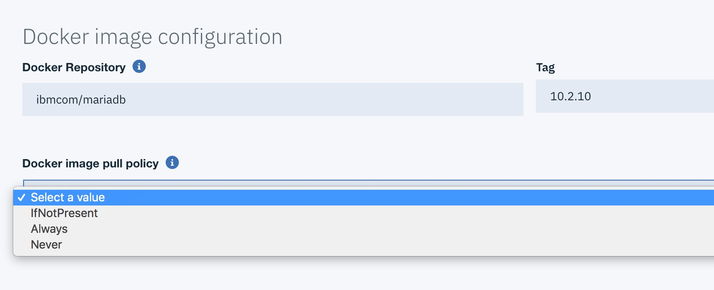

# How to deploy helm charts on an air-gapped ICP cluster?

A helm release usually requires 2 artifacts to deploy:
- A __helm chart__ - set of yaml files in helm directory structure, downloadable from a helm repo
- __Docker image__ - the image of the software required for deployment. The image name and tag are usually defined within the values.yaml of the helm chart. The image is can be pulled from a public Docker hub or a private registry

In an airgapped environment (no Internet access), we have to make both the helm chart and the image available locally

## Create a local helm chart repo
You need to have a web/file server to host your helm charts. In my environment, I have a web server for helm chart @ `http://172.23.50.125/icp-charts`

Follow these steps to make the IBM Cloud private helm charts available in your own environment (also applicable to other helm repo):

__Step 1__ - Git clone the repo into your temp folder

`git clone https://github.com/IBM/charts.git`

All the chart packages are located in `charts/repo/stable`
Note that there is a `index.yaml` file in the folder, this file indexes all the charts with url references to the public repo. We'll need to replace this

__Step 2__ - Regenerate index.yaml
```Shell
cd charts/repo/stable
#helm repo index --url=<local_repo_url> <charts_dir>
helm repo index --url=http://172.23.50.125/icp-charts .
```


Check if the chart indexes in `index.yaml` refer to the local repo


__Step 3__ - Copy/SCP helm packages and index.yaml to the file server
```Shell
cd charts/repo/stable
cp * /webserver/icp-charts
#if web server sitting remotely
#scp -r * usr@webserver:/<LOCAL_REPO_PATH>
```

check if the helm packages are available via HTTP/HTTPS
```Shell
curl http://172.23.50.125/icp-charts/
```


__Step 4__ - Remove the IBM public helm repo
Since the local ICP cluster cannot access the public repo, we can remove it from the repo list
> Login to your ICP console

> Manage > Manage repositories > delete **ibm-charts**


__Step 5__ - Add local chart repo
> Add repository

> name: REPO_NAME

> URL: YOUR_LOCAL_REPO_URL



> Sync repositories

Check if your repo successfully added
> Go to Catalog > Helm charts

> All local charts are listed on the catalog



At this stage all the charts are added locally to the ICP, but you can't yet install them to the ICP cluster because the Docker images for the charts are not available in the local network.

## Pull and import chart images to local environment

I'm going to use MariaDB chart as an example, the other charts would follow the same steps

__Step 6__ - Locate image repo and tag
Details to pull the image are usually found in the values.yaml of the helm chart
> Go back to the file server where you `git clone` the helm charts

> Go to the source folder of the MariaDB helm chart

```Shell
cd charts/stable/ibm-mariadb-dev/
less values.yaml
```
> Find the details under the **image** section



__Step 7__ - Pull the image to your work station

> Pull the image to your work station with Internet access. The image will be pulled from public Docker hub

```
docker pull ibmcom/mariadb:10.2.10
```


__Step 8__ - Save the image to the file system
```Shell
cd /tmp/
docker save ibmcom/mariadb:10.2.10 --output mariadb.tgz
```

__Step 9__ - Copy the image file to the local environment
> Use a USB drive to copy the file to a worker node in your ICP cluster


__Step 10__ - Load the image file to the Worker node's local image repo
```
docker load -i mariadb.tgz
```
> When you import the image using `docker load` all the meta-data of the image will be reserved


> Repeat **Step 9 & 10** for all other worker nodes

> When you install a helm release, it will be scheduled into one of the worker nodes. Helm will try to pull the image from the local repo of the worker node before reaching out to the local private registry and Docker hub.

__Step 11__ - Test deploy a ibm-mariadb-dev helm chart
> Go to ICP catalog and select MariaDB

> Click '**Configure**'

> Provide values all required params e.g. Name, namespace, PV, username, etc.

> Under '**Docker image pull policy**', select '**Never**' --> This option is to tell Docker not pull the image from the registry, but to use the local one instead


> Click '**Install**'

Check if the helm chart is installed successfully

> Check the pod event

